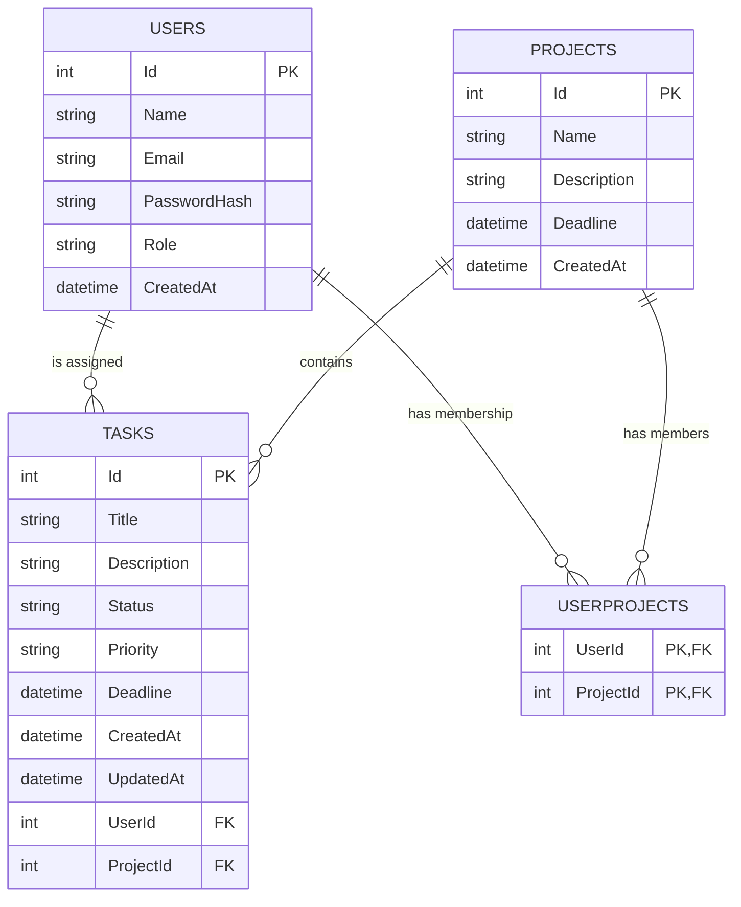

# Employee Task Tracker API

Backend API for an employee task tracking system. It supports user registration/login, JWT authentication, role-based access, project management, project member assignment, and task management.

## Tech Stack

- ASP.NET Core Web API
- Entity Framework Core
- SQL Server
- JWT Bearer Authentication
- BCrypt password hashing
- Swagger/OpenAPI in development

## Base URL

When running locally, the API is available at the URL configured by `Properties/launchSettings.json`.

Common local examples:

```text
https://localhost:7160
http://localhost:5221
```

All endpoints below are relative to the base URL.

## Authentication

Most endpoints require a JWT access token.

Send the token returned from `POST /api/auth/login` in the `Authorization` header:

```http
Authorization: Bearer <jwt-token>
```

## Roles

The API uses two roles:

| Role | Description |
| --- | --- |
| `Employee` | Default role for newly registered users. Employees can view their own profile, their assigned projects, project members for their assigned projects, and their own tasks. |
| `Admin` | Can manage users, projects, assignments, and all tasks. |

## Rate Limiting

The API has request rate limiting enabled.

| Limit | Applies To |
| --- | --- |
| 100 requests per minute | Global API traffic by IP address |
| 5 requests per minute | `POST /api/auth/login` |

If a limit is exceeded, the API returns:

```http
429 Too Many Requests
```

## Pagination

Some list endpoints support pagination using query parameters.

| Query Parameter | Default | Max | Description |
| --- | ---: | ---: | --- |
| `PageNumber` | `1` | - | Page number to return. Must be `1` or greater. |
| `PageSize` | `10` | `50` | Number of items per page. Values above `50` are capped to `50`. |

Paginated responses use this shape:

```json
{
  "items": [],
  "totalCount": 25,
  "pageNumber": 1,
  "pageSize": 10,
  "totalPages": 3
}
```

## Common Status Codes

| Status Code | Meaning |
| --- | --- |
| `200 OK` | Request succeeded. |
| `201 Created` | Resource was created successfully. |
| `204 No Content` | Resource was deleted successfully. |
| `400 Bad Request` | Validation failed or the request cannot be processed. |
| `401 Unauthorized` | Missing or invalid login credentials/token. |
| `403 Forbidden` | Authenticated user does not have permission. |
| `404 Not Found` | Resource does not exist. |
| `429 Too Many Requests` | Rate limit exceeded. |

## Endpoint Summary

| Method | Endpoint | Auth | Description |
| --- | --- | --- | --- |
| `POST` | `/api/auth/login` | Public | Login and receive a JWT token. |
| `GET` | `/api/users` | Admin | Get all users with pagination. |
| `GET` | `/api/users/{id}` | User/Admin | Get a user by ID. Employees can only get themselves. |
| `POST` | `/api/users` | Public | Register a new employee account. |
| `DELETE` | `/api/users/{id}` | Admin | Delete a user if they have no assigned tasks. |
| `PUT` | `/api/users/{id}/promote` | Admin | Promote a user to Admin. |
| `GET` | `/api/projects` | User/Admin | Get visible projects. Admins see all; employees see assigned projects. |
| `GET` | `/api/projects/{id}` | User/Admin | Get project details. Employees must be assigned to the project. |
| `POST` | `/api/projects` | Admin | Create a project. |
| `PUT` | `/api/projects/{id}` | Admin | Update a project. |
| `DELETE` | `/api/projects/{id}` | Admin | Delete a project, its tasks, and its assignments. |
| `GET` | `/api/projectassignments/{projectId}` | User/Admin | Get users assigned to a project. Employees must belong to that project. |
| `POST` | `/api/projectassignments/{projectId}` | Admin | Add users to a project without removing existing users. |
| `PUT` | `/api/projectassignments/{projectId}` | Admin | Replace project assignments with the exact provided user list. |
| `GET` | `/api/tasks` | User/Admin | Get tasks with pagination. Admins see all; employees see their own. |
| `GET` | `/api/tasks/{id}` | User/Admin | Get task details. Employees can only view their own tasks. |
| `POST` | `/api/tasks` | Admin | Create and assign a task. |
| `PUT` | `/api/tasks/{id}` | Assignee/Admin | Update a task. Employees can update their own assigned tasks. |
| `DELETE` | `/api/tasks/{id}` | Admin | Delete a task. |

## Auth Endpoints

### Login

```http
POST /api/auth/login
```

Logs in an existing user and returns a JWT token plus basic user information.

Rate limited to 5 attempts per minute.

Request body:

```json
{
  "email": "admin@example.com",
  "password": "Password123"
}
```

Validation:

| Field | Rules |
| --- | --- |
| `email` | Required, valid email, max 254 characters |
| `password` | Required, max 128 characters |

Success response:

```json
{
  "token": "<jwt-token>",
  "user": {
    "id": 1,
    "name": "Admin User",
    "email": "admin@example.com",
    "role": "Admin",
    "createdAt": "2026-06-03T09:25:00Z"
  }
}
```

Errors:

| Status | Reason |
| --- | --- |
| `401` | Invalid email or password. |
| `429` | Too many login attempts. |

## User Endpoints

### Get All Users

```http
GET /api/users?PageNumber=1&PageSize=10
```

Returns a paginated list of users.

Authorization: Admin only.

Response:

```json
{
  "items": [
    {
      "id": 1,
      "name": "Admin User",
      "email": "admin@example.com",
      "role": "Admin",
      "createdAt": "2026-06-03T09:25:00Z"
    }
  ],
  "totalCount": 1,
  "pageNumber": 1,
  "pageSize": 10,
  "totalPages": 1
}
```

### Get User By ID

```http
GET /api/users/{id}
```

Returns a single user by ID.

Authorization:

- Admins can view any user.
- Employees can only view their own profile.

Response:

```json
{
  "id": 2,
  "name": "Employee User",
  "email": "employee@example.com",
  "role": "Employee",
  "createdAt": "2026-06-03T09:25:00Z"
}
```

Errors:

| Status | Reason |
| --- | --- |
| `403` | Employee tried to view another user's profile. |
| `404` | User was not found. |

### Register User

```http
POST /api/users
```

Creates a new user account. New users are always created with the `Employee` role.

Authorization: Public.

Request body:

```json
{
  "name": "Employee User",
  "email": "employee@example.com",
  "password": "Password123"
}
```

Validation:

| Field | Rules |
| --- | --- |
| `name` | Required, 2-100 characters |
| `email` | Required, valid email, max 254 characters, must be unique |
| `password` | Required, 8-128 characters |

Success response:

```http
201 Created
```

```json
{
  "id": 2,
  "name": "Employee User",
  "email": "employee@example.com",
  "role": "Employee",
  "createdAt": "2026-06-03T09:25:00Z"
}
```

Errors:

| Status | Reason |
| --- | --- |
| `400` | Email is already registered or validation failed. |

### Delete User

```http
DELETE /api/users/{id}
```

Deletes a user.

Authorization: Admin only.

Important: A user cannot be deleted while they have assigned tasks.

Success response:

```http
204 No Content
```

Errors:

| Status | Reason |
| --- | --- |
| `400` | User has assigned tasks. |
| `404` | User was not found. |

### Promote User

```http
PUT /api/users/{id}/promote
```

Promotes a user to the `Admin` role.

Authorization: Admin only.

Success response:

```json
{
  "message": "Employee User has been promoted to Admin."
}
```

Errors:

| Status | Reason |
| --- | --- |
| `404` | User was not found. |

## Project Endpoints

### Get All Projects

```http
GET /api/projects
```

Returns projects visible to the current user.

Authorization:

- Admins see all projects.
- Employees see only projects they are assigned to.

Response:

```json
[
  {
    "id": 1,
    "name": "Website Redesign",
    "description": "Update the public website.",
    "deadline": "2026-07-01T00:00:00Z",
    "createdAt": "2026-06-03T09:25:00Z",
    "totalTasks": 4
  }
]
```

### Get Project By ID

```http
GET /api/projects/{id}
```

Returns details for a single project.

Authorization:

- Admins can view any project.
- Employees can only view projects they are assigned to.

Response:

```json
{
  "id": 1,
  "name": "Website Redesign",
  "description": "Update the public website.",
  "deadline": "2026-07-01T00:00:00Z",
  "createdAt": "2026-06-03T09:25:00Z",
  "totalTasks": 4
}
```

Errors:

| Status | Reason |
| --- | --- |
| `403` | Employee is not assigned to the project. |
| `404` | Project was not found. |

### Create Project

```http
POST /api/projects
```

Creates a new project.

Authorization: Admin only.

Request body:

```json
{
  "name": "Website Redesign",
  "description": "Update the public website.",
  "deadline": "2026-07-01T00:00:00Z"
}
```

Validation:

| Field | Rules |
| --- | --- |
| `name` | Required, 3-150 characters |
| `description` | Optional, max 500 characters |
| `deadline` | Optional date/time |

Success response:

```http
201 Created
```

```json
{
  "id": 1,
  "name": "Website Redesign",
  "description": "Update the public website.",
  "deadline": "2026-07-01T00:00:00Z",
  "createdAt": "2026-06-03T09:25:00Z",
  "totalTasks": 0
}
```

### Update Project

```http
PUT /api/projects/{id}
```

Updates a project.

Authorization: Admin only.

Request body:

```json
{
  "name": "Website Redesign Phase 2",
  "description": "Update the website and dashboard.",
  "deadline": "2026-08-01T00:00:00Z"
}
```

Success response:

```json
{
  "id": 1,
  "name": "Website Redesign Phase 2",
  "description": "Update the website and dashboard.",
  "deadline": "2026-08-01T00:00:00Z",
  "createdAt": "2026-06-03T09:25:00Z",
  "tasks": [],
  "userProjects": []
}
```

Errors:

| Status | Reason |
| --- | --- |
| `404` | Project was not found. |

### Delete Project

```http
DELETE /api/projects/{id}
```

Deletes a project. This also deletes:

- Tasks belonging to the project
- User assignments for the project

Authorization: Admin only.

Success response:

```http
204 No Content
```

Errors:

| Status | Reason |
| --- | --- |
| `404` | Project was not found. |

## Project Assignment Endpoints

### Get Assigned Users

```http
GET /api/projectassignments/{projectId}
```

Returns the users assigned to a project.

Authorization:

- Admins can view assignments for any project.
- Employees can only view assignments for projects they belong to.

Response:

```json
[
  {
    "userId": 2,
    "name": "Employee User",
    "email": "employee@example.com"
  }
]
```

Errors:

| Status | Reason |
| --- | --- |
| `403` | Employee is not assigned to the project. |
| `404` | Project was not found. |

### Add Users To Project

```http
POST /api/projectassignments/{projectId}
```

Adds users to a project without removing existing assignments. Duplicate IDs are ignored.

Authorization: Admin only.

Request body:

```json
{
  "userIds": [2, 3, 4]
}
```

Validation:

| Field | Rules |
| --- | --- |
| `userIds` | Required array of existing user IDs |

Success response:

```json
{
  "message": "Successfully added 3 new users to the project."
}
```

Errors:

| Status | Reason |
| --- | --- |
| `400` | One or more user IDs do not exist. |
| `404` | Project was not found. |

### Sync Project Assignments

```http
PUT /api/projectassignments/{projectId}
```

Replaces the project's assignments with exactly the users in the request body. Existing assignments not included in `userIds` are removed.

Authorization: Admin only.

Request body:

```json
{
  "userIds": [2, 4]
}
```

Success response:

```json
{
  "message": "Project assignments successfully synced."
}
```

Errors:

| Status | Reason |
| --- | --- |
| `400` | One or more user IDs do not exist. |
| `404` | Project was not found. |

## Task Endpoints

### Get All Tasks

```http
GET /api/tasks?PageNumber=1&PageSize=10
```

Returns a paginated list of tasks.

Authorization:

- Admins see all tasks.
- Employees see only tasks assigned to them.

Response:

```json
{
  "items": [
    {
      "id": 1,
      "title": "Create landing page",
      "description": "Build the first version of the landing page.",
      "status": "Pending",
      "priority": "High",
      "deadline": "2026-07-01T00:00:00Z",
      "createdAt": "2026-06-03T09:25:00Z",
      "updatedAt": "2026-06-03T09:25:00Z",
      "userId": 2,
      "assignedTo": "Employee User",
      "projectId": 1,
      "projectName": "Website Redesign"
    }
  ],
  "totalCount": 1,
  "pageNumber": 1,
  "pageSize": 10,
  "totalPages": 1
}
```

### Get Task By ID

```http
GET /api/tasks/{id}
```

Returns details for a single task.

Authorization:

- Admins can view any task.
- Employees can only view tasks assigned to them.

Response:

```json
{
  "id": 1,
  "title": "Create landing page",
  "description": "Build the first version of the landing page.",
  "status": "Pending",
  "priority": "High",
  "deadline": "2026-07-01T00:00:00Z",
  "createdAt": "2026-06-03T09:25:00Z",
  "updatedAt": "2026-06-03T09:25:00Z",
  "userId": 2,
  "assignedTo": "Employee User",
  "projectId": 1,
  "projectName": "Website Redesign"
}
```

Errors:

| Status | Reason |
| --- | --- |
| `403` | Employee tried to view another user's task. |
| `404` | Task was not found. |

### Create Task

```http
POST /api/tasks
```

Creates a task and assigns it to a user in a project.

Authorization: Admin only.

Important: The assigned user must already be a member of the selected project.

Request body:

```json
{
  "title": "Create landing page",
  "description": "Build the first version of the landing page.",
  "status": "Pending",
  "priority": "High",
  "deadline": "2026-07-01T00:00:00Z",
  "userId": 2,
  "projectId": 1
}
```

Validation:

| Field | Rules |
| --- | --- |
| `title` | Required, max 200 characters |
| `description` | Optional, max 1000 characters |
| `status` | `Pending`, `InProgress`, or `Completed` |
| `priority` | String value. Default is `Medium`. |
| `deadline` | Optional date/time |
| `userId` | Required existing user ID |
| `projectId` | Required existing project ID |

Success response:

```http
201 Created
```

```json
{
  "id": 1,
  "title": "Create landing page",
  "description": "Build the first version of the landing page.",
  "status": "Pending",
  "priority": "High",
  "deadline": "2026-07-01T00:00:00Z",
  "createdAt": "2026-06-03T09:25:00Z",
  "updatedAt": "2026-06-03T09:25:00Z",
  "userId": 2,
  "assignedTo": "Employee User",
  "projectId": 1,
  "projectName": "Website Redesign"
}
```

Errors:

| Status | Reason |
| --- | --- |
| `400` | Project does not exist, user does not exist, user is not a project member, or validation failed. |

### Update Task

```http
PUT /api/tasks/{id}
```

Updates task details.

Authorization:

- Admins can update any task.
- Employees can update tasks assigned to them.

Request body:

```json
{
  "title": "Create landing page",
  "description": "Build and polish the first landing page version.",
  "status": "InProgress",
  "priority": "High",
  "deadline": "2026-07-01T00:00:00Z"
}
```

Validation:

| Field | Rules |
| --- | --- |
| `title` | Required, max 200 characters |
| `description` | Optional, max 1000 characters |
| `status` | `Pending`, `InProgress`, or `Completed` |
| `priority` | String value. Default is `Medium`. |
| `deadline` | Optional date/time |

Success response:

```json
{
  "id": 1,
  "title": "Create landing page",
  "description": "Build and polish the first landing page version.",
  "status": "InProgress",
  "priority": "High",
  "deadline": "2026-07-01T00:00:00Z",
  "createdAt": "2026-06-03T09:25:00Z",
  "updatedAt": "2026-06-06T13:00:00Z",
  "userId": 2,
  "assignedTo": "Employee User",
  "projectId": 1,
  "projectName": "Website Redesign"
}
```

Errors:

| Status | Reason |
| --- | --- |
| `403` | Employee tried to update another user's task. |
| `404` | Task was not found. |

### Delete Task

```http
DELETE /api/tasks/{id}
```

Deletes a task.

Authorization: Admin only.

Success response:

```http
204 No Content
```

Errors:

| Status | Reason |
| --- | --- |
| `404` | Task was not found. |

## Entity Relationship Diagram

This API uses four main database tables: `Users`, `Projects`, `Tasks`, and `UserProjects`.



### Relationships

| Relationship | Type | Description |
| --- | --- | --- |
| `Users` to `Tasks` | One-to-many | One user can have many assigned tasks. Each task belongs to one user. |
| `Projects` to `Tasks` | One-to-many | One project can contain many tasks. Each task belongs to one project. |
| `Users` to `Projects` | Many-to-many | Users can belong to many projects, and projects can have many users. This is handled through `UserProjects`. |
| `UserProjects` composite key | Primary key | `UserId` and `ProjectId` together uniquely identify a project membership. |

## Data Models

### User Response

```json
{
  "id": 1,
  "name": "Employee User",
  "email": "employee@example.com",
  "role": "Employee",
  "createdAt": "2026-06-03T09:25:00Z"
}
```

### Project Response

```json
{
  "id": 1,
  "name": "Website Redesign",
  "description": "Update the public website.",
  "deadline": "2026-07-01T00:00:00Z",
  "createdAt": "2026-06-03T09:25:00Z",
  "totalTasks": 4
}
```

### Task Response

```json
{
  "id": 1,
  "title": "Create landing page",
  "description": "Build the first version of the landing page.",
  "status": "Pending",
  "priority": "High",
  "deadline": "2026-07-01T00:00:00Z",
  "createdAt": "2026-06-03T09:25:00Z",
  "updatedAt": "2026-06-03T09:25:00Z",
  "userId": 2,
  "assignedTo": "Employee User",
  "projectId": 1,
  "projectName": "Website Redesign"
}
```

## Example API Flow

1. Register an employee with `POST /api/users`.
2. Login with `POST /api/auth/login`.
3. Use the returned JWT token in `Authorization: Bearer <jwt-token>`.
4. As an Admin, create a project with `POST /api/projects`.
5. Assign users to that project with `POST /api/projectassignments/{projectId}`.
6. Create tasks for project members with `POST /api/tasks`.
7. Employees can view their assigned projects and tasks with `GET /api/projects` and `GET /api/tasks`.

## Swagger

Swagger is enabled in development mode.

After starting the API, open:

```text
/swagger
```
